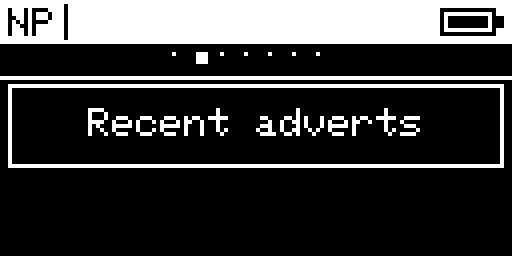
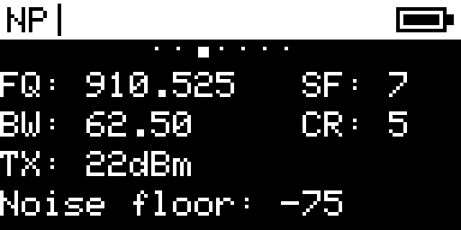
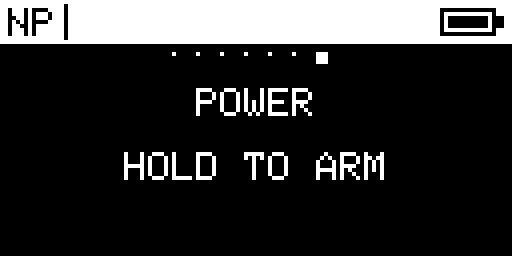

  

# NeonPocketMC for Heltec V4

Experimental MeshCore BLE, native-USB, and Ultimate Wi-Fi/Web companion firmware for the **Heltec WiFi LoRa 32 V4/V4.3 with its integrated 128×64 SSD1306 OLED and SX1262**.

> [!WARNING]
> **Standard integrated-OLED Heltec V4/V4.3 only. Do not flash this on Heltec V3, the V4 TFT expansion build, RCC6, RC52, Wireless Tracker, or another hardware variant.** BLE, USB, and Web are separate images. Never flash a build for another board.

**Guided install:** [flasher.canadaverse.org](https://flasher.canadaverse.org/)

## What is included

- MeshCore 1.17.1 receive-gain fix line, based on exact upstream commit `727fc0512ce08bfd7b499e46daa7fca6eeec730d`.
- Upstream V4/V4.3 hardware handling retained intact: runtime GC1109/KCT8103L FEM support, VFEM power sequencing, SX1262 register `0x8B5` receive patch, DIO2 RF switching, 1.8 V DIO3 TCXO, active-high Vext, battery sensing, and integrated OLED.
- A smooth procedural NeonPocket startup, compact phone-like Home dashboard, Inbox, Nearby, Radio, Bluetooth, Advert, and confirmed Power pages.
- 350 contacts, 40 channels, and 256 pending companion frames.
- 60-second OLED timeout while BLE and LoRa continue running.
- Fail-closed storage mounting. Existing identity, contacts, channels, and preferences are not silently formatted after a mount error.

## Ultimate experimental builds

Three additional targets bring the portable RCC6 Ultimate experience to the 128×64 OLED:

- `heltec_v4_ultimate_companion_ble`: standard MeshCore BLE companion compatibility plus persistent history, metrics, recent-node signal tracking, composer state, and diagnostics.
- `heltec_v4_ultimate_companion_web`: setup AP, local 2.4 GHz Wi-Fi mode, authenticated offline WebUI, full TCP companion protocol on port 5000, history/export/settings/location APIs, and signed app-slot OTA support.
- `heltec_v4_ultimate_repeater_web`: a dedicated MeshCore repeater with an authenticated live dashboard, recent-neighbor view, radio/packet/battery/airtime graphs, flood-advert controls, restricted radio/location/name configuration, and AP-to-LAN onboarding.

Both use 350 contacts, 40 channels, 256 pending companion frames, a 32-event callback queue, a 64-node recent-heard cache, selectable 0/128/512/2048-message history, seven-day hourly metrics, a 32 KiB runtime allocation gate, and the existing NeonPocket demo-scene startup. The OLED adds compact Network and Ultimate status pages; the full composer, charts, history manager, location transfer, and Wi-Fi onboarding live in the WebUI.

BLE and Wi-Fi never run together. In Web mode, HTTP is authenticated, but TCP port 5000 intentionally exposes the complete MeshCore companion/admin protocol to the trusted local LAN. Do not use station mode on an untrusted network.

For the Ultimate Web dashboard, the LAN login is username **`meshcore`** plus the generated eight-letter **device key**. The setup page shows the exact pair before restart; the OLED and 115200-baud USB serial console show it afterward beside the LAN address. The device key is not the home Wi-Fi password.

The Ultimate Repeater is a separate role image: it does not expose the companion TCP protocol and it never runs BLE. On first boot, join the `NeonPocket-XXXXXX` setup AP and open `http://192.168.4.1`. The OLED and USB serial output show the generated 12-character key; use username `neonpocket`. After local Wi-Fi is saved, the OLED shows the LAN IP at boot. If the saved network cannot be reached within ten seconds, the private setup AP returns. Wi-Fi stays awake in this build, so use the standard repeater image for solar/battery deployments.

The RCC6 indexed color framebuffer, 220×128 tile animations, and color-only notification effects are hardware-specific and are not copied to this monochrome OLED build.

The firmware value `TX 10 dBm` is intentional on this board: MeshCore’s V4 hardware layer drives the external PA and Heltec documents the board for substantially higher final RF output. Do not copy V3 power values into V4.

## Button controls

- Screen off: the first gesture only wakes the OLED.
- Single press: next page or next Inbox message.
- Double press: current-page action; on Home it opens Inbox.
- Triple press: return to Home; from Inbox it also clears every local unread message.
- Hold: show Power confirmation.
- Hold again within eight seconds while confirmation is visible: hibernate after release.
- During the first eight seconds after boot, hold enters MeshCore CLI Rescue.

## Install

Download the current experimental [`v2.0.0-rc.2` release](https://github.com/n30nex/NeonPocketMC-Heltec-V4/releases/tag/v2.0.0-rc.2).

- Normal update: flash `NeonPocketMC-Heltec-V4-BLE-app.bin` at offset `0x10000`.
- Wired companion: flash `NeonPocketMC-Heltec-V4-USB-app.bin` at offset `0x10000`.
- BLE recovery: flash `NeonPocketMC-Heltec-V4-BLE-recovery-preserves-settings.bin` at offset `0x0`.
- USB recovery: flash `NeonPocketMC-Heltec-V4-USB-recovery-preserves-settings.bin` at offset `0x0`.

The recovery image replaces boot/application metadata and clears ESP32 NVS state such as old BLE bonds, but does not extend into the SPIFFS data partition that holds MeshCore identity and preferences. Always verify the published SHA-256 manifest before flashing, attach a suitable antenna before transmitting, and use USB recovery if an experimental candidate fails to boot.

## Hardware gallery

These frames were exported from the SSD1306 framebuffer of the connected V4 qualification unit. They are actual device output, not browser mockups.

  

<table>
  <tr>
    <td align="center"> <strong>Home</strong></td>
    <td align="center"> <strong>Nearby</strong></td>
  </tr>
  <tr>
    <td align="center"> <strong>Radio</strong></td>
    <td align="center"> <strong>Bluetooth</strong></td>
  </tr>
  <tr>
    <td align="center"> <strong>Advert</strong></td>
    <td align="center"> <strong>Power</strong></td>
  </tr>
</table>

Capture provenance and checksums are recorded in [`docs/images/README.md`](docs/images/README.md).

## Status

`v2.0.0-rc.2` is experimental. It retains the RC1 feature set and fixes the Ultimate Web AP-to-LAN handoff by exposing the exact HTTP login before restart and on the OLED and USB console afterward. The release is built and checked locally on the Canadaverse Pi 5; no new physical V4 receipt is claimed for RC2.

## Upstream and licensing

This is a community project, not an official Heltec or MeshCore release. It is derived from [meshcore-dev/MeshCore](https://github.com/meshcore-dev/MeshCore). Upstream and third-party license files remain in this source tree.
